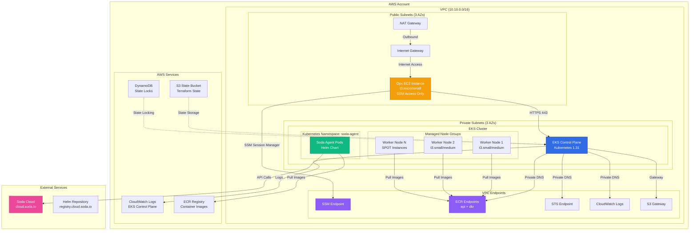

# Soda Infrastructure - Terraform/Terragrunt

This repository contains the infrastructure as code for deploying Soda Agent on AWS using Terraform and Terragrunt.

## **Infrastructure Overview**

The infrastructure consists of:
- **VPC with private/public subnets** across 3 AZs
- **VPC Endpoints** for SSM, ECR, STS, CloudWatch Logs, and S3
- **EKS Cluster** with managed node groups
- **Ops Infrastructure** (EC2 instance, security groups, IAM roles)
- **Soda Agent** deployed via Helm on EKS

## **Architecture Diagram**

The following diagram illustrates the complete infrastructure stack and component relationships:



### **Component Details**

#### **Network Layer**
- **VPC**: Isolated network environment (10.10.0.0/16)
- **Public Subnets**: Internet-facing resources (NAT Gateway, Ops EC2)
- **Private Subnets**: Internal resources (EKS cluster, worker nodes)
- **3 Availability Zones**: High availability across eu-west-1a, eu-west-1b, eu-west-1c

#### **Compute Layer**
- **EKS Cluster**: Managed Kubernetes control plane
  - **Dev**: 1-2 nodes, t3.small, public endpoint enabled
  - **Prod**: 2-5 nodes, t3.medium/large, private endpoint only
- **Ops EC2**: Administrative instance for cluster management
  - Access via SSM Session Manager (no SSH keys)
  - IAM role with EKS access permissions

#### **Security Layer**
- **Security Groups**: Network-level firewall rules
  - Ops SG: Outbound HTTPS to SSM endpoints only
  - EKS SG: Ingress from Ops SG on port 443
- **VPC Endpoints**: Private connectivity to AWS services
  - No internet gateway required for AWS API calls
  - Reduced data transfer costs
  - Enhanced security posture

#### **Application Layer**
- **Soda Agent**: Data quality monitoring agent
  - Deployed via Helm chart
  - Runs in dedicated Kubernetes namespace
  - Authenticates to Soda Cloud via API keys
  - Pulls container images from private registry

#### **State Management**
- **S3 Backend**: Terraform state storage (encrypted)
- **DynamoDB**: State locking to prevent concurrent modifications
- **Per Environment**: Separate state buckets for dev/prod

### **Data Flow**

1. **Deployment Flow**:
   - Terraform/Terragrunt → S3 State Bucket → DynamoDB Lock
   - Creates infrastructure in dependency order (VPC → EKS → Soda Agent)

2. **Operational Flow**:
   - Ops EC2 → EKS API (via private endpoint or public if enabled)
   - EKS Nodes → VPC Endpoints → AWS Services (ECR, STS, CloudWatch)
   - Soda Agent Pods → ECR (via VPC endpoint) → Pull images
   - Soda Agent Pods → Soda Cloud → Send data quality metrics

3. **Logging Flow**:
   - EKS Control Plane → CloudWatch Logs (via VPC endpoint)
   - Application Logs → CloudWatch Logs
   - Retention: 7 days (dev), 30 days (prod)

## **Directory Structure**

```
Soda-Agent/
├── root.hcl                        # Repository root config (org definition)
├── module/                          # Shared Terraform modules
│   ├── helm-soda-agent/            # Soda Agent Helm deployment
│   └── ops-ec2-eks-access/        # EKS access configuration
├── env/                            # Environment-specific configurations
│   ├── dev/
│   │   ├── root.hcl               # Environment-level config (env = "dev")
│   │   └── eu-west-1/
│   │       ├── root.hcl           # Region-level config (aws_region)
│   │       ├── bootstrap/          # Phase 0: Bootstrap (one-time)
│   │       ├── network/
│   │       │   ├── vpc/            # Phase 1: VPC
│   │       │   └── vpc-endpoints/  # Phase 2: VPC Endpoints
│   │       ├── ops/
│   │       │   ├── sg-ops/         # Phase 3: Security Groups
│   │       │   └── ec2-ops/        # Phase 5: EC2 Instance
│   │       ├── eks/
│   │       │   ├── terragrunt.hcl  # Phase 4: EKS Cluster
│   │       │   └── ops-ec2-eks-access/  # Phase 6: EKS Access
│   │       └── addons/
│   │           └── soda-agent/     # Phase 7: Soda Agent
│   └── prod/
│       └── eu-west-1/              # Same structure as dev
├── deploy.sh                       # Automated deployment script
├── destroy.sh                      # Automated destruction script
├── bootstrap.sh                    # One-time bootstrap script
├── .pre-commit-config.yaml         # Pre-commit hooks configuration
├── .gitignore                      # Git ignore rules
└── README.md                       # This file
```

### **Terragrunt Configuration Hierarchy**

The configuration follows a hierarchical structure:

```
root.hcl (repo root)
  └── org = "datashift"
  
env/dev/root.hcl
  └── includes root.hcl
  └── env = "dev"
  └── common_tags (without Region)
  
env/dev/eu-west-1/root.hcl
  └── includes env/dev/root.hcl
  └── aws_region = "eu-west-1"
  └── common_tags (with Region added)
  └── state_bucket, lock_table
```

This structure allows:
- **DRY Configuration**: Environment settings defined once
- **Multi-Region Support**: Easy to add new regions
- **Consistent Tagging**: Tags inherited through the hierarchy

## **Bootstrap Process (One-Time Setup)**

**CRITICAL**: Bootstrap must be run ONCE per environment before any other deployment.

The bootstrap process creates:
- **S3 bucket** for Terraform state storage
- **DynamoDB table** for state locking
- **IAM policies** and configurations

### **When to Bootstrap:**
- **New environment** (dev, prod)
- **First time setup**
- **Existing environment** (already has state bucket)

### **Bootstrap Command:**
```bash
./bootstrap.sh <environment>

# Examples:
./bootstrap.sh prod    # Bootstrap production environment
./bootstrap.sh dev     # Bootstrap development environment
```

### **Bootstrap Safety Features:**
- **Automatic detection** of existing resources
- **Multiple confirmation prompts** to prevent accidents
- **Automatic disable** after completion
- **Resource existence checks** before proceeding

## **Deployment Order**

**CRITICAL**: Infrastructure must be deployed in this specific order due to dependencies:

### **Phase 0: Bootstrap (One-time)**
```bash
./bootstrap.sh <env>  # Run this FIRST for new environments
```

### **Phase 1: VPC**
```bash
cd env/<env>/eu-west-1/network/vpc
terragrunt apply --auto-approve
```

### **Phase 2: VPC Endpoints**
```bash
cd ../vpc-endpoints
terragrunt apply --auto-approve
```

### **Phase 3: Security Groups (Ops)**
```bash
cd ../../ops/sg-ops
terragrunt apply --auto-approve
```

### **Phase 4: EKS Cluster**
```bash
cd ../../eks
terragrunt apply --auto-approve
```

### **Phase 5: EC2 Ops Instance**
```bash
cd ../ops/ec2-ops
terragrunt apply --auto-approve
```

### **Phase 6: EKS Access Configuration**
```bash
cd ../../eks/ops-ec2-eks-access
terragrunt apply --auto-approve
```

### **Phase 7: Soda Agent**
```bash
cd ../../addons/soda-agent
terragrunt apply --auto-approve
```

## **Orchestrated Deployment**

For convenience, you can deploy everything in one command (after bootstrap):

```bash
# Deploy all 7 phases automatically
./deploy.sh <env>

# Deploy specific phase only
./deploy.sh <env> <phase>

# Examples:
./deploy.sh prod        # Deploy all phases
./deploy.sh prod 3      # Deploy phase 3 only (Security Groups)
./deploy.sh dev 7       # Deploy phase 7 only (Soda Agent)
```

**Note**: The deployment script respects dependencies and deploys in the correct order.

## **Destruction Order**

To destroy infrastructure, use the reverse order or the orchestrated command:

```bash
# Destroy everything automatically (reverse order)
./destroy.sh <env>

# Destroy specific phase only
./destroy.sh <env> <phase>

# Or destroy manually in reverse order (7 → 1)
cd addons/soda-agent && terragrunt destroy --auto-approve          # Phase 7
cd ../../eks/ops-ec2-eks-access && terragrunt destroy --auto-approve  # Phase 6
cd ../../ops/ec2-ops && terragrunt destroy --auto-approve            # Phase 5
cd ../../eks && terragrunt destroy --auto-approve                    # Phase 4
cd ../ops/sg-ops && terragrunt destroy --auto-approve                # Phase 3
cd ../../network/vpc-endpoints && terragrunt destroy --auto-approve  # Phase 2
cd ../vpc && terragrunt destroy --auto-approve                       # Phase 1
```

## **Environment Variables**

### **Required for Soda Agent**
```bash
export SODA_API_KEY_ID="your-soda-cloud-api-key"
export SODA_API_KEY_SECRET="your-soda-cloud-api-secret"
export SODA_IMAGE_APIKEY_ID="your-soda-registry-api-key"
export SODA_IMAGE_APIKEY_SECRET="your-soda-registry-api-secret"
```

### **Optional**
```bash
export SODA_CLOUD_REGION="eu"  # or "us"
export SODA_LOG_FORMAT="raw"   # or "json"
export SODA_LOG_LEVEL="INFO"   # ERROR, WARN, INFO, DEBUG, TRACE
```

## **Common Issues & Troubleshooting**

### **1. Bootstrap Issues**
**Error**: `NoSuchBucket` or `NoSuchTable`

**Solution**: Run bootstrap first:
```bash
./bootstrap.sh <env>
```

### **2. Dependency Errors**
**Error**: `detected no outputs` or `Unknown variable: dependency`

**Causes & Solutions**:
- **During initial deployment**: This is normal when dependencies haven't been applied yet. Use the automated deployment scripts.
- **Corrupted terragrunt.hcl files**: Check for error messages accidentally pasted into configuration files.
- **Missing mock outputs**: Ensure `dependency` blocks have proper `mock_outputs` for validation.

**Fix corrupted files**:
```bash
# Check for error messages in terragrunt.hcl files
grep -r "ERROR\|WARN" env/*/eu-west-1/*/terragrunt.hcl

# Restore from working dev environment if needed
cp env/dev/eu-west-1/ops/sg-ops/terragrunt.hcl env/prod/eu-west-1/ops/sg-ops/terragrunt.hcl
```

### **3. EKS Cluster Not Found**
**Error**: `reading EKS Cluster: couldn't find resource`

**Solution**: Deploy the EKS cluster first before deploying addons or EKS access configurations.

### **4. IAM Role Not Found**
**Error**: `reading IAM Role: couldn't find resource`

**Solution**: Deploy the ops infrastructure (EC2, security groups) before deploying EKS access configurations.

### **5. Soda Agent Namespace Issues**
**Error**: `namespaces "soda-agent" not found`

**Solution**: The Soda Agent module now creates the namespace explicitly. This error should be resolved with the updated module.

**Manual fix if needed**:
```bash
# Connect to EKS cluster
aws eks update-kubeconfig --region eu-west-1 --name <cluster-name>

# Create namespace manually
kubectl create namespace soda-agent
```

### **6. Helm Chart Download Issues**
**Error**: `401 Unauthorized` when downloading Helm chart

**Solution**: 
```bash
# Add the Soda Helm repository
helm repo add soda-agent https://registry.cloud.soda.io/chartrepo/agent
helm repo update
```

### **7. Image Pull BackOff**
**Error**: `pull access denied, repository does not exist or may require authorization`

**Solution**: Ensure `SODA_IMAGE_APIKEY_ID` and `SODA_IMAGE_APIKEY_SECRET` are set correctly.

### **8. Agent Registration Errors**
**Error**: `agent with name already registered`

**Solution**: Use unique agent names by appending timestamps or use different API keys.

### **9. Terragrunt Configuration Corruption**
**Error**: Error messages appearing in terragrunt.hcl files

**Symptoms**:
- Files contain terminal output mixed with configuration
- `Unknown variable: dependency` errors
- Validation failures

**Solution**:
```bash
# Check for corrupted files
find env/ -name "terragrunt.hcl" -exec grep -l "ERROR\|WARN\|arnaudgueulette" {} \;

# Restore from working environment
cp env/dev/eu-west-1/ops/sg-ops/terragrunt.hcl env/prod/eu-west-1/ops/sg-ops/terragrunt.hcl
```

### **10. Deployment Order Issues**
**Error**: Resources failing due to missing dependencies

**Solution**: Always use the automated deployment scripts:
```bash
# For full deployment
./deploy.sh <env>

# For specific phases
./deploy.sh <env> <phase>
```

## **Cleanup & Maintenance**

### **Remove Generated Files**
```bash
# Remove Terraform artifacts
find . -name ".terraform" -type d -exec rm -rf {} \;
find . -name ".terraform.lock.hcl" -exec rm -f {} \;
find . -name "*.tfstate*" -exec rm -f {} \;
find . -name "*.tfplan" -exec rm -f {} \;
find . -name "versions_override.tf" -exec rm -f {} \;
find . -name "provider_override.tf" -exec rm -f {} \;
```

### **Clear Terragrunt Cache**
```bash
rm -rf ~/.terragrunt-cache
```

## **Pre-deployment Checklist**

- [ ] **Bootstrap completed** (one-time setup)
- [ ] AWS credentials configured (`aws configure` or environment variables)
- [ ] Soda API keys exported as environment variables
- [ ] Helm repositories added and updated
- [ ] No existing infrastructure conflicts
- [ ] Proper AWS region selected
- [ ] S3 bucket for Terraform state exists (created by bootstrap)

## **Module Dependencies**

```
bootstrap (one-time)
├── Phase 1: network/vpc
│   ├── Phase 2: network/vpc-endpoints (depends on vpc)
│   ├── Phase 3: ops/sg-ops (depends on vpc)
│   ├── Phase 4: eks (depends on vpc)
│   │   ├── Phase 5: ops/ec2-ops (depends on vpc + ops/sg-ops)
│   │   └── Phase 6: ops-ec2-eks-access (depends on eks + ops/ec2-ops)
│   └── Phase 7: addons/soda-agent (depends on eks)
```

## **Useful Commands**

### **Bootstrap**
```bash
./bootstrap.sh <env>           # Bootstrap new environment
```

### **Deploy**
```bash
./deploy.sh <env>              # Deploy all 7 phases
./deploy.sh <env> <phase>      # Deploy specific phase (1-7)
```

### **Destroy**
```bash
./destroy.sh <env>             # Destroy all 7 phases (reverse order)
./destroy.sh <env> <phase>     # Destroy specific phase (1-7)
```

### **Validate Configuration**
```bash
terragrunt validate-inputs
terragrunt hcl validate --inputs
```

### **Plan Changes**
```bash
terragrunt plan
```

### **Apply Changes**
```bash
terragrunt apply --auto-approve
```

### **Check Status**
```bash
terragrunt output
terragrunt show
```

### **Force Unlock State**
```bash
terragrunt force-unlock <lock-id>
```

## ⚡ **Quick Reference**

### **Most Common Commands**
```bash
# Bootstrap new environment (one-time)
./bootstrap.sh prod

# Deploy all 7 phases
./deploy.sh prod

# Deploy specific phase (1-7)
./deploy.sh prod 3    # Deploy Security Groups only
./deploy.sh prod 7    # Deploy Soda Agent only

# Destroy all 7 phases (reverse order)
./destroy.sh prod

# Destroy specific phase (1-7)
./destroy.sh prod 7   # Destroy Soda Agent only

# Check for corrupted files
find env/ -name "terragrunt.hcl" -exec grep -l "ERROR\|WARN" {} \;

# Validate configuration
terragrunt hcl validate --inputs
```

### **Environment Variables Setup**
```bash
export SODA_API_KEY_ID="your-api-key"
export SODA_API_KEY_SECRET="your-api-secret"
export SODA_IMAGE_APIKEY_ID="your-image-key"
export SODA_IMAGE_APIKEY_SECRET="your-image-secret"
```

## **Getting Help**

1. **Check this README** for common issues and solutions
2. **Run bootstrap first** for new environments
3. **Review dependency order** - most issues are related to deployment sequence
4. **Check environment variables** - ensure all required variables are set
5. **Verify AWS resources** - ensure no conflicts with existing infrastructure
6. **Check Terraform state** - ensure state is consistent
7. **Use automated scripts** - avoid manual terragrunt commands for complex deployments

## **Recent Improvements**

### **Configuration Structure (2024)**
- **Hierarchical Configuration**: Reorganized Terragrunt configs with repo → environment → region hierarchy
- **DRY Principle**: Organization name defined once at repo root, inherited by all environments
- **Multi-Region Ready**: Region-specific configs make it easy to add new AWS regions

### **Security Enhancements**
- **Environment-Specific Security**: Prod EKS endpoint is private-only, dev can be restricted to CIDRs
- **CloudWatch Logging**: EKS control plane logging enabled (7 days dev, 30 days prod)
- **Encryption**: EKS secrets encryption at rest enabled
- **VPC Flow Logs**: Enabled for prod environment

### **Operational Improvements**
- **Pre-commit Hooks**: Automated Terraform validation, formatting, and security scanning
- **Resource Tagging**: Standardized common tags across all resources
- **Environment-Specific Configs**: Different instance sizes, node counts for dev vs prod
- **Cost Optimization**: Prod uses multiple NAT gateways for HA, dev uses single NAT

### **Soda Agent Module Updates**
- **Namespace Creation**: Added explicit `kubernetes_namespace` resource to ensure namespace exists before creating secrets
- **Dependency Management**: Improved resource dependencies to prevent race conditions
- **Helm Configuration**: Disabled `create_namespace` in Helm release since we create it explicitly

### **Terragrunt Configuration Fixes**
- **Mock Outputs**: Added proper mock outputs for all dependency blocks to enable validation
- **Dependency Ordering**: Ensured correct `dependencies` and `dependency` block usage
- **Configuration Validation**: Fixed corrupted terragrunt.hcl files that contained error messages

### **Deployment Scripts**
- **Automated Deployment**: Enhanced deployment scripts with better error handling
- **Phase-based Deployment**: Improved phase-by-phase deployment with proper dependency resolution
- **Bootstrap Safety**: Added multiple safety checks and confirmations for bootstrap process

## **Notes**

- **Bootstrap**: Set to `skip = true` by default. Run `./bootstrap.sh <env>` for new environments.
- **State Management**: Uses S3 backend with DynamoDB locking (created by bootstrap).
- **Provider Versions**: Pinned to specific versions for stability.
- **Tags**: Consistent tagging strategy across all resources.
- **Security**: VPC endpoints for private communication, minimal public access.
- **Namespace Management**: Soda Agent namespace is now created explicitly by Terraform for better control.

---

**Last Updated**: December 2024  
**Terraform Version**: >= 1.6  
**Terragrunt Version**: >= 0.54  
**AWS Provider**: >= 5.0, < 6.0
